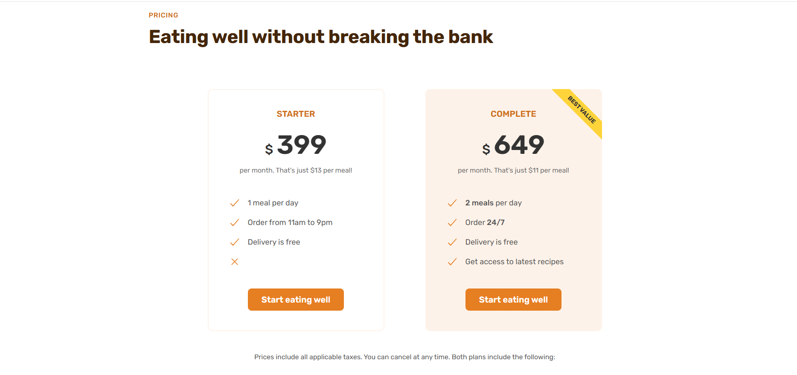
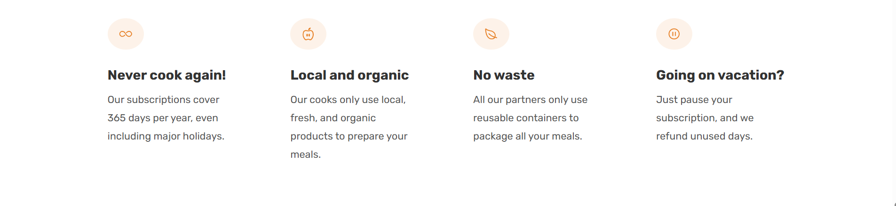

# Omnifood 🍽️ - Meal Website

**Omnifood** is a fully responsive, beautifully designed front-end website built using **HTML5** and **CSS3**. It showcases a modern UI/UX and simulates a smart meal subscription service, offering users personalized meal plans and seamless delivery options.

This project demonstrates strong frontend development skills including layout design, responsive styling, UI patterns, mobile-first design, and accessibility.

---

## 🚀 Features

- 🔥 **Responsive Design** – Optimized for all screen sizes: desktop, tablet, and mobile.
- ✨ **Modern UI/UX** – Clean layout, intuitive navigation, and elegant use of typography and spacing.
- 🥗 **Dynamic Meal Sections** – Structured menus, nutritional info, and beautiful imagery.
- 👥 **Testimonials & Social Proof** – Highlighting user feedback and media mentions.
- 💳 **Pricing Plans** – Clear, value-oriented pricing tiers.
- 📸 **Gallery & CTA** – Visual food gallery and conversion-focused call-to-action sections.
- 🌐 **Semantic HTML** – Proper structure using sections, headings, and accessibility best practices.
- 🧑‍💻 **Clean CSS Architecture** – Modular, organized stylesheets with media queries for responsiveness.

---

## 📁 Technologies Used

- **HTML5** – Semantic, accessible markup.
- **CSS3** – Flexbox, Grid, Media Queries, Custom Styling.
- **Google Fonts** – "Rubik" font for aesthetic typography.
- **Ionicons** – Icon set for enhanced visuals.
- **Mobile-First Approach** – Prioritized performance and design for mobile users.

---

## 📷 Preview

[Omnifood Screenshot](img/imageOmni/s1.png)
[Omnifood Screenshot](img/imageOmni/s2.png)
[Omnifood Screenshot](img/imageOmni/s3.png)
[Omnifood Screenshot](img/imageOmni/s4.png)
[Omnifood Screenshot](img/imageOmni/s5.png)
[Omnifood Screenshot](img/imageOmni/s6.png)
[Omnifood Screenshot](img/imageOmni/s7.png)

Explore the live preview: _[Link to live demo if deployed]_ (e.g., GitHub Pages, Netlify)

---

## 💼 Why This Project?

This project was crafted to reflect my front-end development skills with a strong focus on:

- **Code quality**
- **Design thinking**
- **Responsiveness**
- **User-centric interfaces**

---
